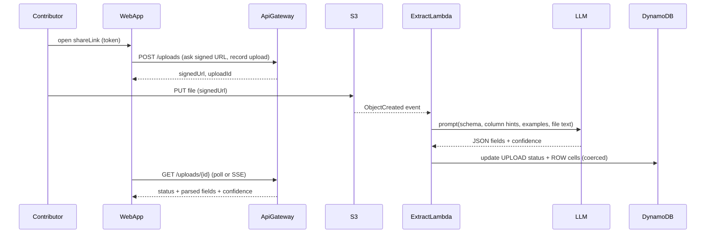

# Collector Architecture

Link-based, schema-led data capture with zero-login contributors, file uploads, and LLM-assisted extraction. Built on a tiny serverless stack (AWS SAM + DynamoDB + S3) with a Next.js App Router frontend.

## Problem & Principles
- Schema-led: columns (name, type, hint, examples) are the contract for UI validation and LLM prompts.
- Frictionless: owners use magic links; contributors use tokenized share links (optional passcode/expiry), no signup.
- Async extraction with visibility: upload → immediate ack → background parse → status/confidence surfaced in UI.
- Human in the loop: LLM proposes; deterministic post-processing coerces types and flags low confidence for manual edit.
- Minimal moving parts: one Dynamo table, one S3 bucket, a handful of Lambdas; add queues/workers only when needed.

## System Topology
- **Frontend (`/web`):** Next.js (App Router), React Query, axios client that attaches link/owner tokens; client components for sheet editing, uploads, reorder, inline validation.
- **Backend (`/backend`):** AWS SAM, Node/TS Lambdas behind API Gateway; single-table DynamoDB; S3 for file storage; S3 event to Extract Lambda; optional EventBridge later.
- **Auth:** Owners via magic-link email; contributors via share-link token (optional passcode/expiry). Tokens carried in headers/query for API calls.
- **LLM:** Single provider behind a thin client; schema-driven prompts; low temperature; deterministic coercion afterward.

## End-to-End Flow (Upload → Extract → Update)

## Data Model (single-table DynamoDB)
- Workspace: `PK=WORKSPACE#{id}` / `SK=METADATA` (owner email, title, plan, limits)
- Columns: `PK=WORKSPACE#{id}` / `SK=COLUMN#{columnId}` (name, type, description, order, examples, enum values)
- Rows: `PK=WORKSPACE#{id}` / `SK=ROW#{rowId}` (cells, status, createdAt, createdByLinkId)
- Uploads: `PK=WORKSPACE#{id}` / `SK=UPLOAD#{uploadId}` (s3Key, rowId?, status, parsedFields, confidence, errors)
- Share links: `PK=WORKSPACE#{id}` / `SK=LINK#{linkId}` (token hash, passcode hash?, expiresAt, permissions)
- GSI (optional): ownerEmail → workspaces

## API Surface (SAM Lambdas behind API Gateway)
- Auth & links: create magic link for owner; create/validate share link with optional passcode/expiry.
- Schema: `GET/PUT /workspaces/{id}/columns` (define/update/reorder columns).
- Rows: `GET/POST/PUT /workspaces/{id}/rows` (list, add, edit cells; bulk paste).
- Uploads: `POST /workspaces/{id}/uploads` (issue signed URL, create upload record), `GET /workspaces/{id}/uploads/{uploadId}` (status + parsed fields).
- Exports: `GET /workspaces/{id}/export` (CSV/XLSX/JSON).

## Auth Model
- Owners: passwordless magic link → session token/cookie; governs workspace creation and share-link issuance.
- Contributors: tokenized share link in URL; optional passcode; no account; rate-limited per link/IP; activities stamped with linkId.

## Extraction & LLM Strategy
- Prompt includes column schema (names, types, help, examples) and requests strict JSON with per-field confidence.
- Temperature low; max tokens bounded; reject oversized/binary uploads; OCR text for images/PDFs as needed.
- Post-process: type coercion (date/number/enum/email/url/money/json), confidence thresholds, unresolved fields stay null for manual fill.
- States: `pending → processing → succeeded | partial | failed`; retries are idempotent per uploadId; keep raw text for re-parse.

## Error Handling & Observability
- Consistent JSON error envelopes; permissive CORS for the share link origin.
- Structured logs on Lambdas; capture prompt/result (with redaction) for debugging; basic metrics: upload counts, extraction success rate, latency.
- Rate limits on uploads and row writes per link; size/type limits on files; optional virus scan step.

## Growth & Pricing Hooks
- Footer CTA on shared sheets/exports: “Collected with Collector — create your own.”
- One-click duplicate of any sheet a contributor sees; template gallery (RFP intake, vendor onboarding, diligence).
- Pricing: Free (1 workspace, limited columns/uploads), Pro flat monthly (higher limits, passcodes/branding/exports), usage add-on per 100 parses; contributors always free.

## Repo Mapping
- Backend lives in [`/backend`](backend/) (SAM template, Lambdas per feature, shared libs for auth/response/validation, Dynamo/S3 clients).
- Frontend lives in [`/web`](web/) (App Router pages, feature folders with `api/`, `hooks/`, components, shared axios + React Query providers).

